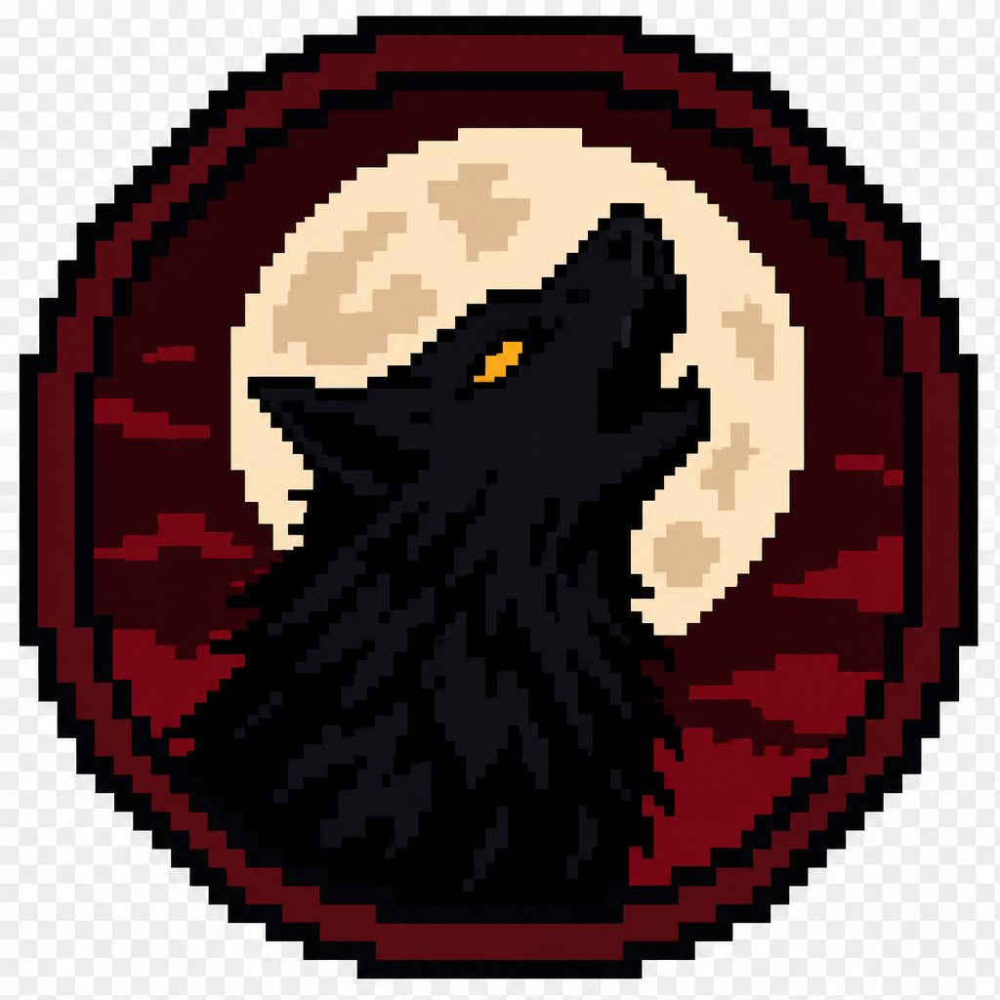
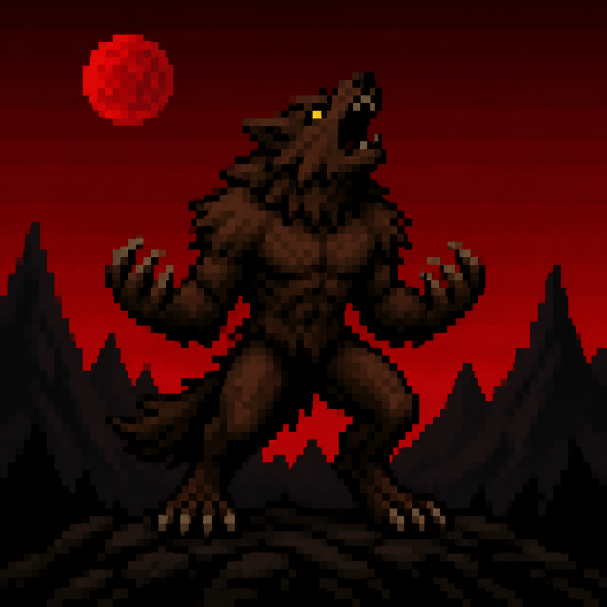
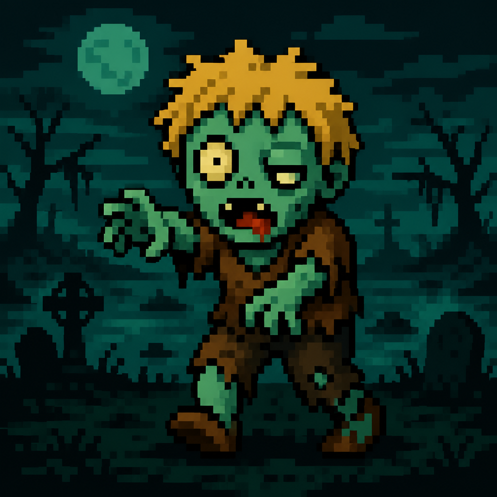
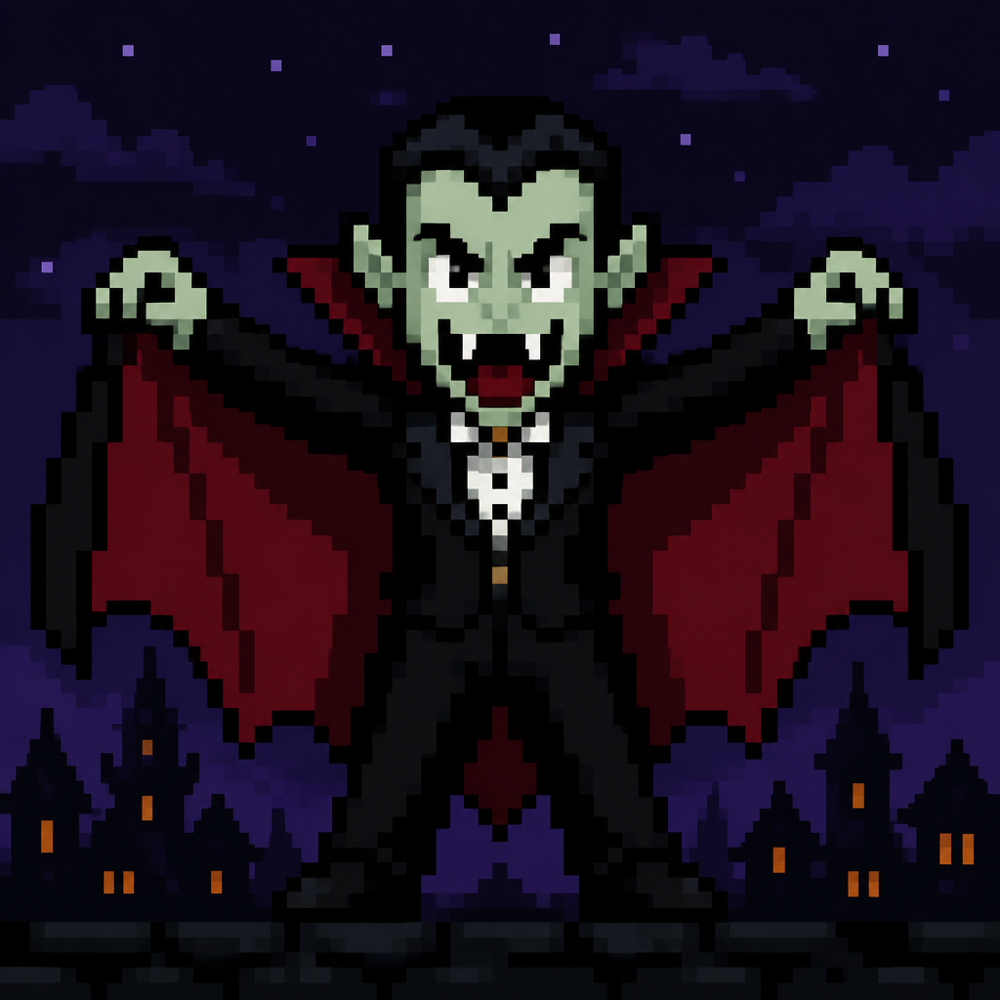
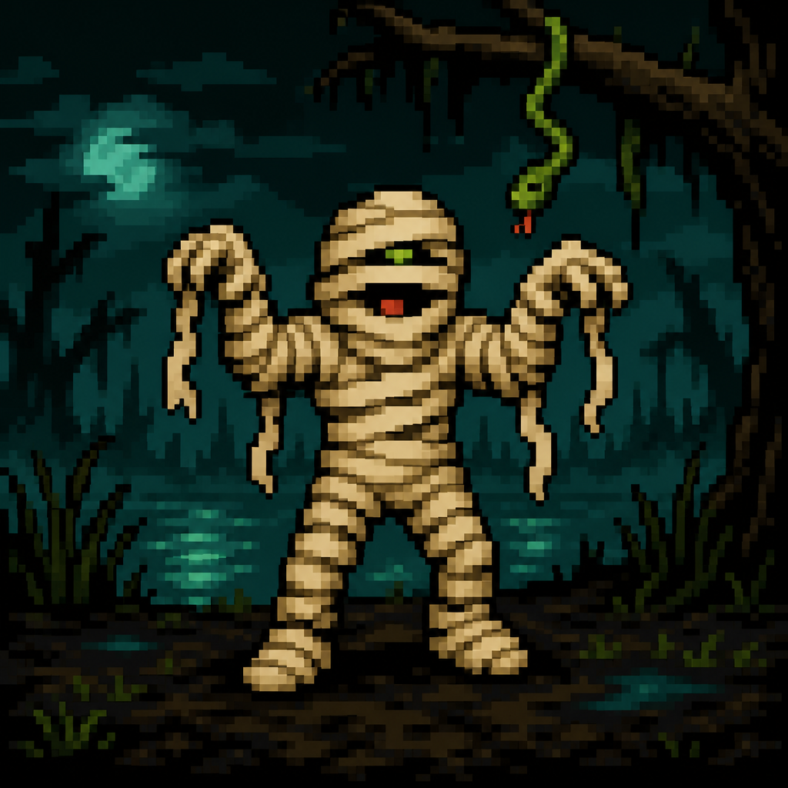
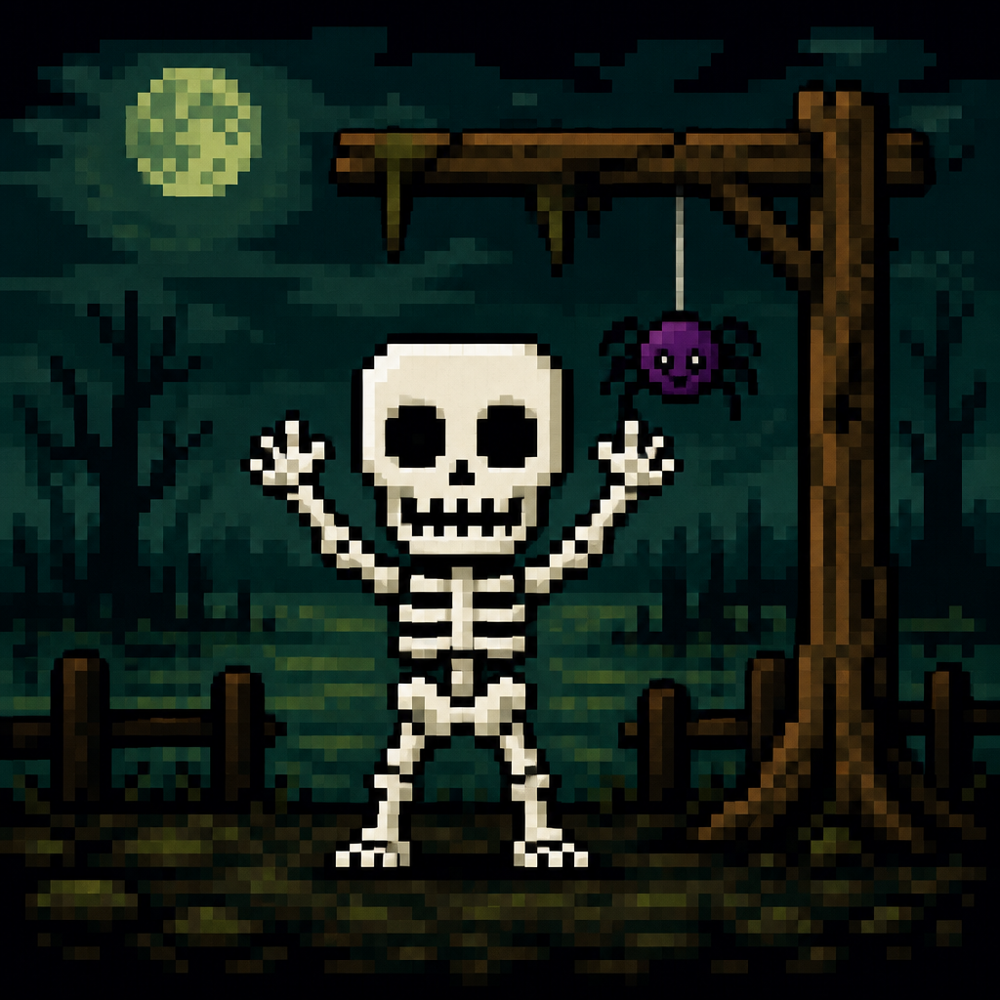
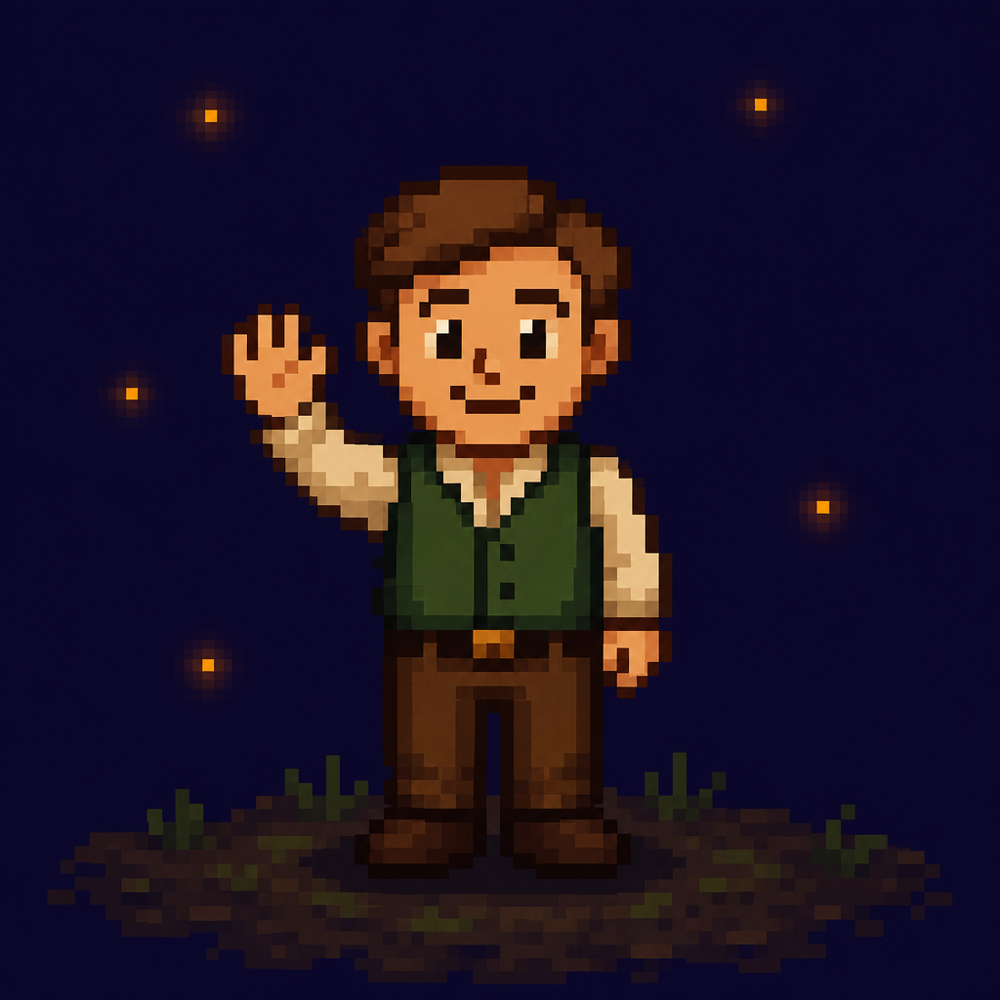
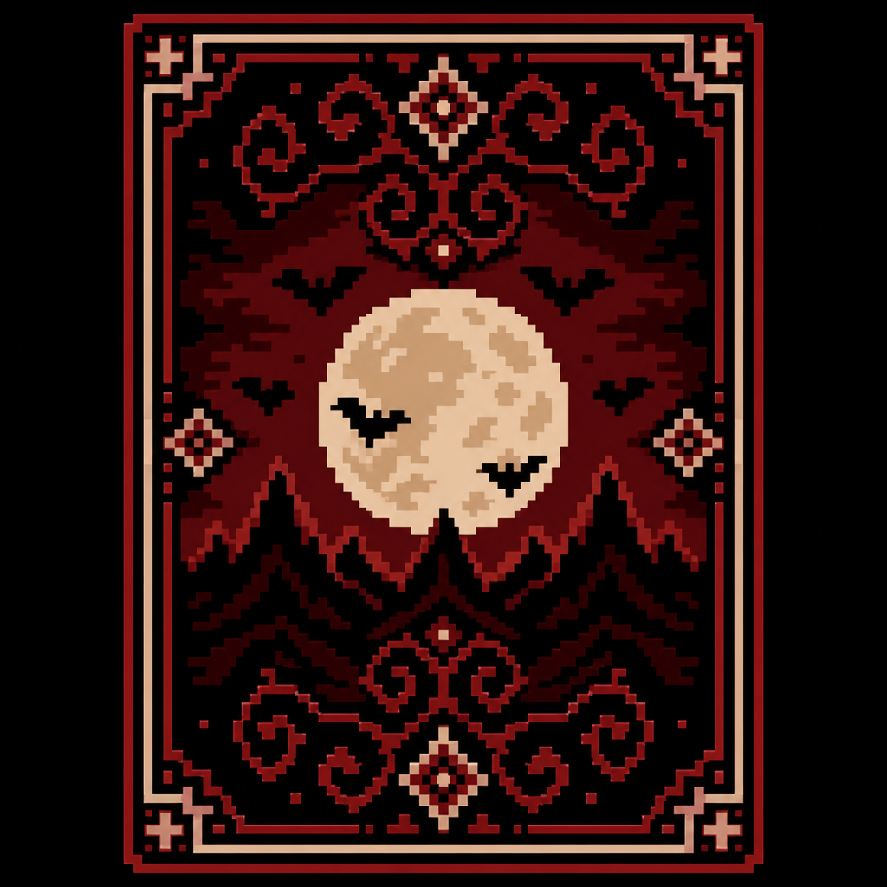

# Monster Card Game

[](https://lobisomem-monstros.vercel.app)
[](https://nextjs.org)
[](https://supabase.com)
[](LICENSE)

<p align="center">
  
</p>

<p align="center">
  <strong>Lobisomem por Uma Noite — Monstros</strong><br />
  Jogo multiplayer online, mobile-first e 100% em pt-BR.<br />
  3 a 7 jogadores · uma noite · um monstro entre vocês.
</p>

<p align="center">
  <a href="https://lobisomem-monstros.vercel.app"><strong>▶ Jogar agora</strong></a>
</p>

---

## O que é

Recriação online do jogo de dedução social *Lobisomem por Uma Noite: Monstros*:
cada celular é uma tela secreta, a noite é guiada por narração, e a lógica das
cartas roda **só no servidor** — ninguém vê a carta alheia.

> Arte pixel em `public/art/` é **original** (inspirada no estilo do jogo físico).
> Não redistribuímos scans das cartas oficiais.

## Papéis

| Time | Papéis |
| --- | --- |
| **Aliados** | Aldeão, Bruxa, Caçador, Vampiro |
| **Lobisomens** | Lobisomem (×2 no baralho completo) |
| **Mortos-vivos** | Zumbi, Múmia, Esqueleto |

<p align="center">
  
  
  
  
</p>
<p align="center">
  
  
  
  
  
</p>

### Ações da noite

| Papel | Ação |
| --- | --- |
| **Lobisomem** | Reconhece os outros lobisomens e vê as 3 cartas do centro |
| **Zumbi** | Pega uma carta do centro, assume o papel e executa a ação dele |
| **Vampiro** | Troca a própria carta com a de um jogador ou do centro |
| **Bruxa** | Olha a carta de um jogador |
| **Caçador** | Pega uma carta do centro e esconde (troca sem revelar aos outros) |
| Aldeão / Múmia / Esqueleto | Dormem |

## Como jogar

1. Alguém **cria a sala** e compartilha o código de 4 letras.
2. Cada um recebe uma carta secreta; **3 cartas** ficam no centro.
3. **Noite (~1m40s)** — narração chama cada papel na ordem.
4. **Discussão (5–10 min)** — blefem, acusem, mentam.
5. **Votação** — quem tiver mais votos, morre (empate: todos empatados morrem).

### Vitória (cartas finais, após as trocas)

- Um **morto-vivo** morreu → Mortos-vivos vencem  
- Um **lobisomem** morreu → Aliados vencem  
- Caso contrário → Lobisomens vencem  

## Stack

- **Next.js 16** (App Router, TypeScript, Tailwind CSS 4) na [Vercel](https://lobisomem-monstros.vercel.app)
- **Supabase** — Postgres + Realtime (broadcast de “estado mudou”)
- Motor puro e testável em [`lib/game/`](lib/game/)
- Mutações só via API routes com **service role** (server-authoritative)

```
Cliente (UI pt-BR)
    │  POST /api/rooms/...
    ▼
Next.js route handlers  ──service_role──►  Supabase Postgres
    │                                           │
    └── HTTP broadcast "update" ──► Realtime ──► clientes refetch view pessoal
```

## Estrutura

```
app/
  page.tsx                 # Home: criar / entrar
  sala/[code]/page.tsx     # Lobby → Noite → Discussão → Voto → Resultado
  api/rooms/               # create, join, start, action, vote, advance…
components/phases/         # Telas de cada fase
lib/game/                  # Engine, roles, timeline (+ testes)
lib/api/                   # Room store + views personalizadas
public/art/                # Pixel art HD original
supabase/schema.sql        # Tabela rooms + RLS
```

## Rodando localmente

Pré-requisitos: Node 20+, projeto [Supabase](https://supabase.com).

```bash
npm install
cp .env.example .env.local
# Preencha as 3 variáveis (URL, publishable key, secret key)
# Aplique supabase/schema.sql no SQL Editor do Supabase
npm run dev
```

| Variável | Uso |
| --- | --- |
| `NEXT_PUBLIC_SUPABASE_URL` | URL do projeto |
| `NEXT_PUBLIC_SUPABASE_PUBLISHABLE_KEY` | Frontend (só Realtime) |
| `SUPABASE_SECRET_KEY` | **Somente servidor** — nunca no browser |

```bash
npm test          # motor do jogo
npm run lint
npm run build
```

## Áudio da noite

Sem arquivo oficial, a narração usa **síntese de voz pt-BR** do navegador.

1. Coloque o áudio em `public/audio/noite.mp3` (~1m40s).
2. Ajuste os timestamps em [`lib/game/timeline.ts`](lib/game/timeline.ts).

## Deploy

O projeto de produção está em **https://lobisomem-monstros.vercel.app**.

Para outro ambiente:

1. Importe o repo na Vercel.
2. Configure as 3 variáveis (Production + Preview).
3. Aplique `supabase/schema.sql` no Supabase.

## Aviso legal

Inspirado no jogo de tabuleiro *Lobisomem por Uma Noite: Monstros* (e na série
*One Night Ultimate Werewolf*). Este repositório **não é afiliado** aos
detentores da marca. A implementação e a arte pixel em `public/art/` são
originais.

## Contribuindo

Veja [CONTRIBUTING.md](CONTRIBUTING.md).

## Licença

[MIT](LICENSE) — código e arte original deste repositório.
